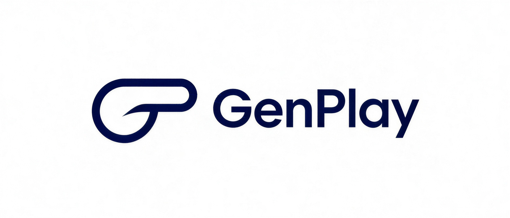

<div align="center">



# GenPlay

**AI-Native Interactive Game Agent Platform**

> Where imagination becomes playable — craft AI-native games, agent by agent.


[Melo](#what-is-melo) · [Innovation](#innovation) · [Features](#features) · [Models](#voice-models) · [Studio](#creation-studio) · [Use Cases](#use-cases) · [Quickstart](#quick-start) · [Philosophy](#philosophy)

#### [English](./README.md) | [中文文档](./README_CN.md)

</div>


## What is GenPlay?

GenPlay is an **AI-native game creation & editing platform** — a complete playground for crafting, refining, and shipping games that live and breathe through intelligent agents.

Here, AI is not an add-on to a static game. GenPlay makes **the agent the very medium of play**: every character, rule, world, and interaction is born from, and driven by, AI-native behavior.

At its core stands a single conviction: **a game is not a finished product — it is a living conversation.** In an AI-native world, play is no longer a fixed set of rules waiting to be followed. It is an open dialogue that grows, reacts, and remembers.

GenPlay unfolds along two intertwined paths:

- **Create & edit AI-native games** — shape worlds, characters, and mechanics from scratch, then reshape them live through agent-driven editing.
- **Explore AI-native games** — venture into gameplay, interaction, and game types that only an AI-native world can hold.

Whether you are a creator building a new world or a player stepping into one, GenPlay lets you move freely between both roles — because in AI-native games, the line between making and playing begins to dissolve.

More than a tool, GenPlay is a **playground for invention** — a place to rethink what a game is, and how we play it, in the age of AI.


## Create & Edit: Bringing AI-Native Games to Life

On GenPlay, creation and editing are not separate steps — they are one continuous act of making, guided by agents at every turn.

- **Agent-First Creation** — the agent is the core of the craft, not a supplement. Characters reason, react, and co-create with you, turning vague ideas into concrete, playable worlds.
- **Conversational Editing** — reshape your game by simply talking to it. Agents translate your intent into playable content, letting you adjust rules, scenes, and characters as naturally as holding a conversation.
- **Live Co-Creation** — you are never working alone. Agents act as co-designers who propose, adapt, and refine alongside you — without ever pausing the action.
- **Worlds That Remember** — AI-native characters and settings carry past moments forward, so your creation keeps growing as a living place, and every edit builds on what came before.
- **From Prompt to Ecosystem** — the platform itself is a canvas. Begin from a single idea and grow it into a living, interconnected game world — and everything in between.


## Explore: The Next Shape of AI-Native Games

Beyond making, GenPlay is a launchpad for discovering what play can become in the AI era — built to question the familiar and invent what comes next.

- **New Gameplay** — play that no static ruleset could express. Agents generate, adapt, and evolve play in ways that surprise even their creators; the rules themselves become part of the play.
- **New Interaction Modes** — play that moves beyond screens and controllers: conversational play, emergent dialogue, and worlds that respond to you as a person, not just a player.
- **New Game Types** — genres that exist only in an AI-native world: stories that write themselves, worlds that remember you, challenges that never repeat.
- **New Creative Workflows** — reimagine how games are made, from a single prompt to a living ecosystem, opening doors that traditional pipelines never reached.

On GenPlay, you are not bound by what games were — you define what they can be.


## Getting Started

```bash
# clone the repository
git clone https://github.com/Yuan-ManX/GenPlay.git
cd GenPlay

# install dependencies
npm install

# start the development playground
npm run dev
```


## License

GenPlay is licensed under the MIT License. See [LICENSE](./LICENSE) for details.


## ⭐ Star History

If this vision resonates, please ⭐ star the repo. Your support helps GenPlay grow.

<p align="center">
  <a href="https://star-history.com/#Yuan-ManX/GenPlay&Date">
    
  </a>
</p>
